# LLM Workflows — From LLM Basics to Production Agents

A practical roadmap for learning **LLM workflows, RAG, LangChain, LangGraph, Agents, Agentic RAG, Multi-Agent Systems, and Production AI Systems**.

The goal is not to memorize frameworks.

The goal is to understand **how intelligent LLM systems are designed, connected, evaluated, and deployed.**

---

## Roadmap

```text
Basic LLM
   │
   ▼
Prompt Chaining
   │
   ▼
Routing
   │
   ▼
Parallelization
   │
   ▼
RAG
   │
   ▼
Tool Calling
   │
   ▼
Agents
   │
   ▼
Agentic RAG
   │
   ▼
Corrective RAG
   │
   ▼
Reflection / Self-Correction
   │
   ▼
Human-in-the-Loop
   │
   ▼
Multi-Agent Systems
   │
   ▼
Long-Running Agents
   │
   ▼
Production AI Systems
```

---

# 1. Basic LLM Workflow

Start with the simplest possible architecture.

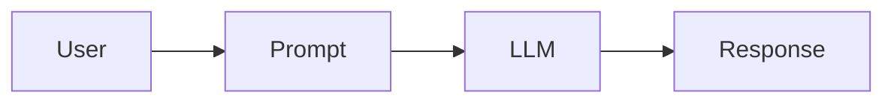

### Learn

* System prompts
* User prompts
* Prompt templates
* Chat messages
* Temperature
* Max tokens
* Streaming
* Structured output
* JSON output
* Function/tool calling basics
* Model APIs
* Local models with Ollama

### Example

```text
User Question
      ↓
Prompt Template
      ↓
LLM
      ↓
Structured Response
```

### Build

**Simple AI Assistant**

Input → LLM → Answer

---

# 2. Prompt Chaining

Break a complicated task into multiple LLM calls.

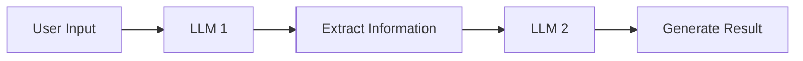

### Example

```text
Job Description
      ↓
Extract Skills
      ↓
Generate Interview Questions
      ↓
Generate Evaluation Criteria
```

### Learn

* Sequential chains
* Output passing
* Prompt composition
* Structured outputs
* Error handling
* Intermediate results

### Build

**AI Job Description Analyzer**

---

# 3. Routing Workflow

The LLM decides which workflow should handle the request.

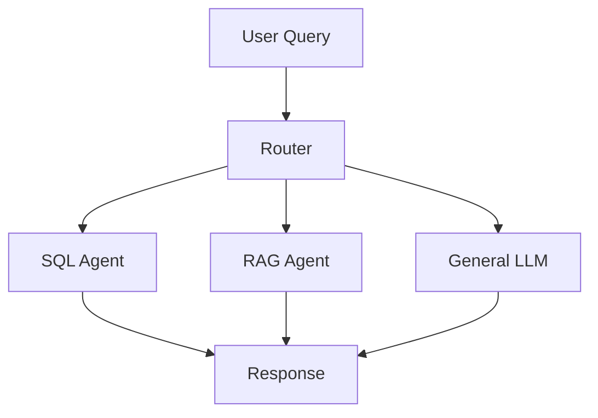

### Example

```text
"What is my attendance?"
        ↓
Attendance Agent

"Explain this PDF"
        ↓
RAG Agent

"Write Python code"
        ↓
Coding Agent
```

### Learn

* Intent classification
* Conditional routing
* Structured routing
* Fallback routes
* Query classification

### Build

**Multi-Purpose College AI Assistant**

---

# 4. Parallel Workflow

Run multiple operations independently.

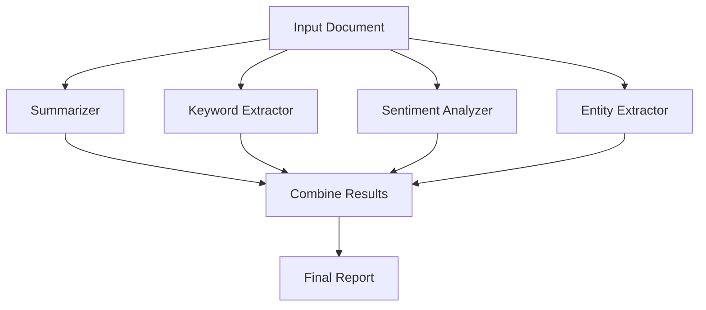

### Why?

Instead of:

```text
Task 1
 ↓
Task 2
 ↓
Task 3
 ↓
Task 4
```

you can execute independent tasks:

```text
        ┌→ Task 1
Input ──┼→ Task 2
        ├→ Task 3
        └→ Task 4
              ↓
           Combine
```

### Learn

* Parallel execution
* Async workflows
* State merging
* Result aggregation

### Build

**Document Intelligence Pipeline**

---

# 5. RAG Workflow

Retrieval-Augmented Generation is one of the most important LLM architectures.

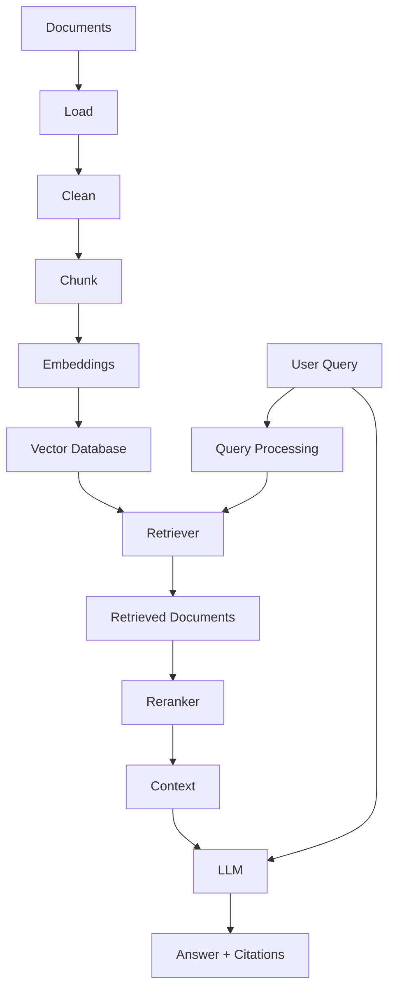

### Learn

#### Document Processing

* PDF parsing
* HTML parsing
* DOCX
* TXT
* CSV
* Images
* OCR

#### Chunking

* Fixed-size chunking
* Recursive chunking
* Semantic chunking
* Parent-child retrieval

#### Embeddings

* Sentence Transformers
* OpenAI embeddings
* BGE
* E5
* Embedding dimensions
* Similarity metrics

#### Retrieval

* Vector search
* Metadata filtering
* Similarity search
* MMR
* Hybrid search

#### Advanced Retrieval

* Query rewriting
* Multi-query retrieval
* HyDE
* Reranking
* Context compression

#### Generation

* Grounded answers
* Citations
* Context windows
* Hallucination control

### Build

**Multimodal RAG**

```text
PDF + DOCX + TXT + CSV + Images
                ↓
             Parser
                ↓
            Chunking
                ↓
            Embeddings
                ↓
           Vector DB
                ↓
             Retriever
                ↓
             Reranker
                ↓
               LLM
                ↓
        Answer + Sources
```

---

# 6. Tool Calling

Now allow the LLM to interact with external systems.

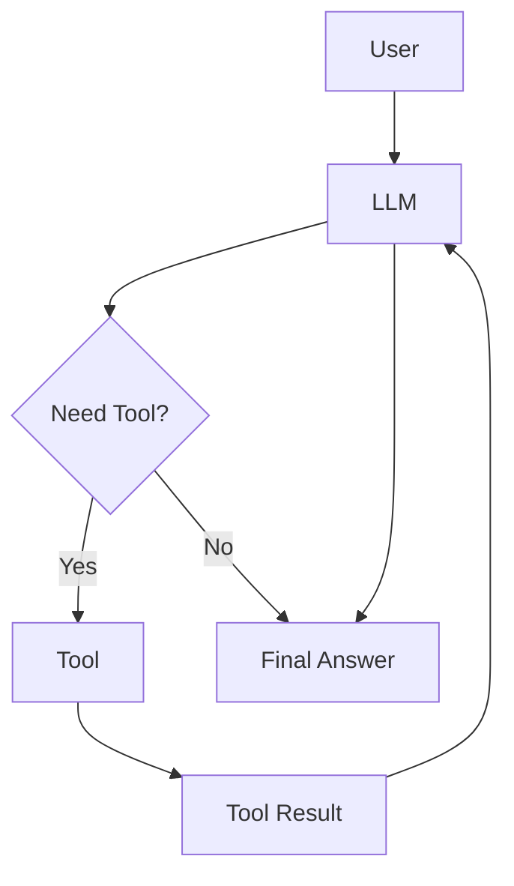

### Tools can include

* Calculator
* SQL
* Web search
* Python
* APIs
* File search
* Email
* Calendar
* GitHub
* Database

### Learn

* Tool schemas
* Function calling
* Tool execution
* Tool results
* Error handling
* Tool permissions

### Build

**AI Data Analyst**

```text
User
 ↓
LLM
 ↓
SQL Tool
 ↓
Database
 ↓
Query Result
 ↓
LLM
 ↓
Natural Language Answer
```

---

# 7. Agent Workflow

An agent can decide what action to take.

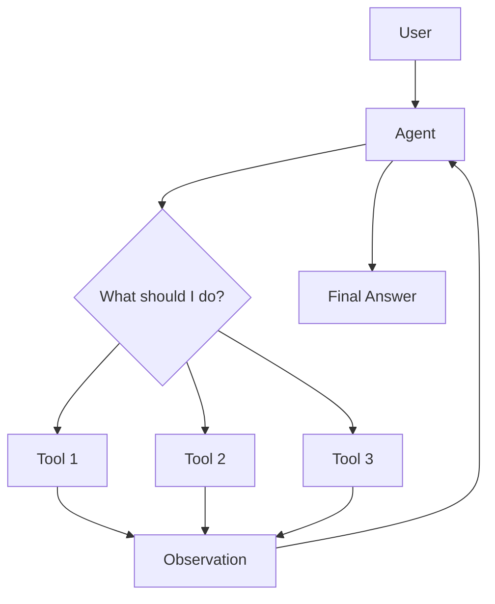

### Agent Loop

```text
Think
 ↓
Choose Tool
 ↓
Execute Tool
 ↓
Observe
 ↓
Think Again
 ↓
Choose Tool
 ↓
...
 ↓
Final Answer
```

### Learn

* Agent loop
* Tool selection
* Agent state
* Tool errors
* Maximum iterations
* Agent memory
* Tool permissions

### Build

**Personal AI Agent**

Give it:

```text
Calculator
SQL
Web Search
Python
File Search
Weather
GitHub
```

---

# 8. Agentic RAG

Traditional RAG follows a relatively fixed pipeline.

Agentic RAG lets the system decide **how to retrieve information**.

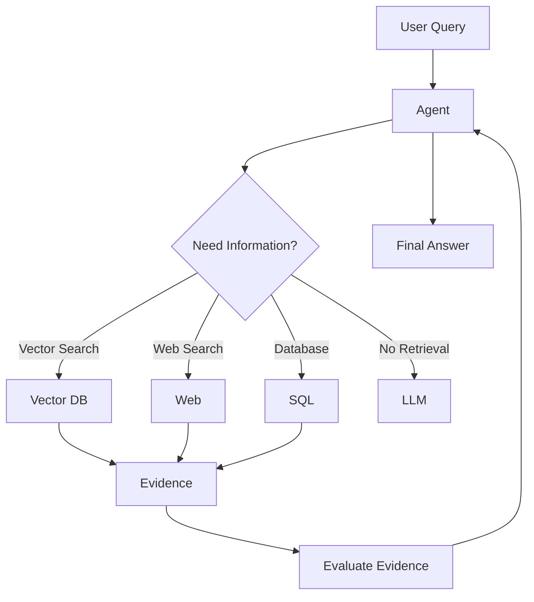

### Example

User:

> "Compare our company's 2025 sales with the latest market trends."

The agent might:

```text
Company Data → SQL
Market Trends → Web Search
Documents → Vector DB
        ↓
Combine Evidence
        ↓
Generate Analysis
```

### Learn

* Retrieval planning
* Tool selection
* Query decomposition
* Multi-source retrieval
* Evidence evaluation
* Agentic loops

### Build

**Enterprise Research Agent**

---

# 9. Corrective RAG — CRAG

The system checks whether retrieved information is actually useful.

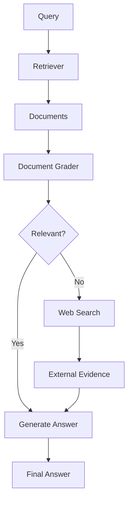

### Core idea

```text
Retrieve
   ↓
Grade
   ↓
Good?
 ┌─┴─┐
Yes  No
 ↓    ↓
LLM  Search Again
```

### Learn

* Retrieval evaluation
* Relevance grading
* Fallback retrieval
* Web augmentation
* Grounding

### Build

**Self-Correcting RAG**

---

# 10. Reflection / Self-Correction

The LLM generates something and another process evaluates it.

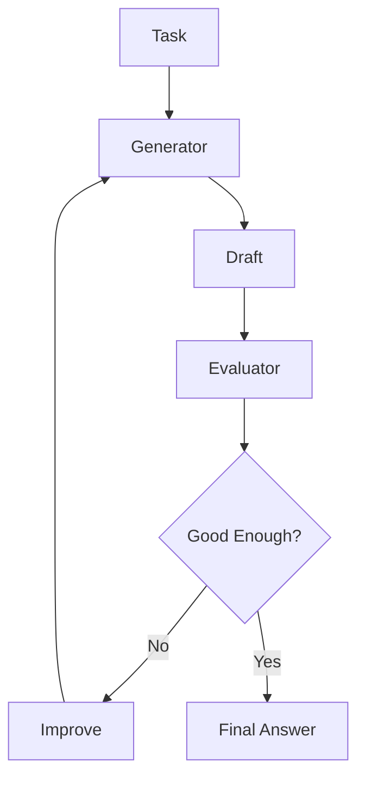

### Example

```text
Generate Code
     ↓
Review Code
     ↓
Find Problems
     ↓
Fix Code
     ↓
Review Again
     ↓
Final Code
```

### Learn

* Reflection
* Critic models
* Evaluation criteria
* Iterative refinement
* Quality thresholds
* Loop termination

### Build

**AI Code Reviewer + Fixer**

---

# 11. Human-in-the-Loop

Not every decision should be fully autonomous.

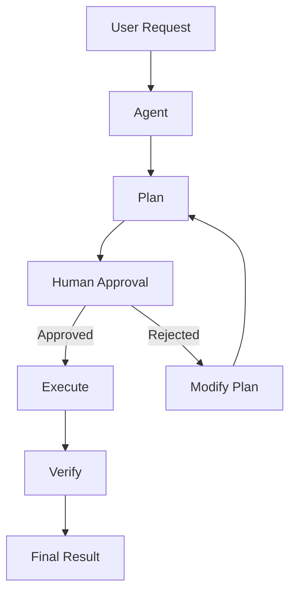

### Example

```text
Agent:
"I am going to send this email."

        ↓

Human:
"Approve"

        ↓

Agent:
"Send Email"
```

### Use it for

* Sending emails
* Deleting data
* Financial actions
* Database modifications
* Publishing content
* Production deployments

### Learn

* Interrupts
* Approval states
* Checkpoints
* Resume execution
* State persistence

---

# 12. Multi-Agent Workflow

Multiple specialized agents work together.

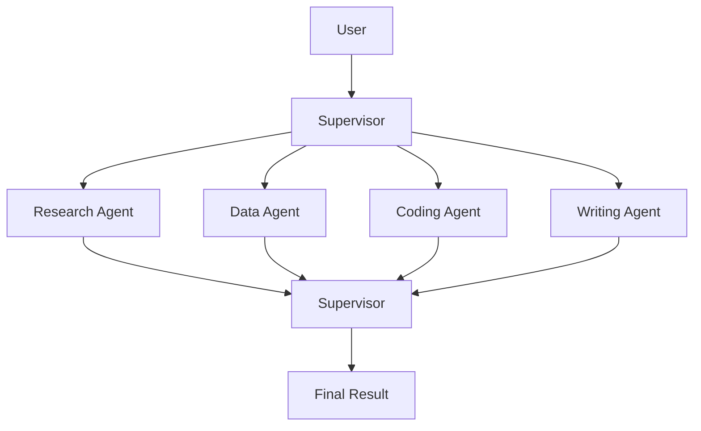

### Example

For a research task:

```text
Supervisor
    │
    ├── Research Agent
    │
    ├── Data Analysis Agent
    │
    ├── Fact Checking Agent
    │
    └── Writer Agent
             ↓
         Final Report
```

### Learn

* Supervisor pattern
* Agent handoffs
* Shared state
* Agent communication
* Task delegation
* Specialized agents
* Failure handling

### Build

**Multi-Agent Research System**

---

# 13. Long-Running Agents

Real-world agents may need minutes, hours, or days to complete a task.

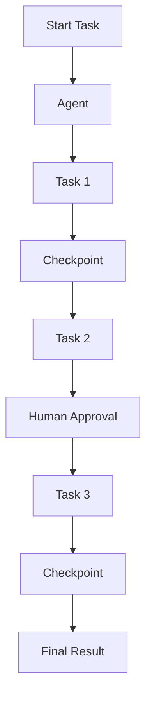

### Learn

* Persistent state
* Checkpointing
* Resuming
* Retry logic
* Failure recovery
* Background jobs
* Human interruptions
* Long-running workflows

### Build

**Autonomous Research Agent**

Example:

```text
Research topic
      ↓
Search sources
      ↓
Read documents
      ↓
Extract information
      ↓
Analyze
      ↓
Write report
      ↓
Human review
      ↓
Publish
```

---

# 14. Production LLM Workflow

Now combine everything.

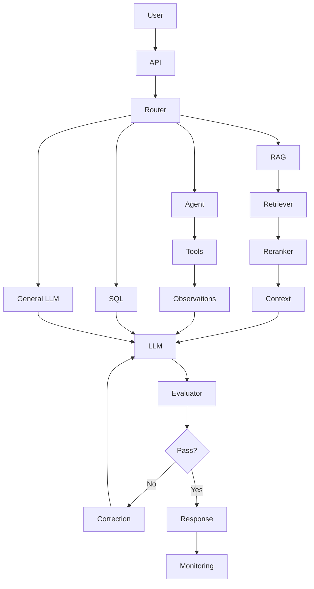

### Production layer

Add:

* Authentication
* Rate limiting
* Logging
* Observability
* Tracing
* Evaluation
* Prompt versioning
* Model versioning
* Caching
* Retries
* Guardrails
* Security
* Cost monitoring
* Latency monitoring
* Database persistence

---

# Framework Mapping

| Concept            | Useful Technology                           |
| ------------------ | ------------------------------------------- |
| LLM                | OpenAI / Anthropic / Gemini / Groq / Ollama |
| Prompting          | LangChain                                   |
| Chains             | LangChain                                   |
| Routing            | LangGraph                                   |
| Parallel workflows | LangGraph                                   |
| RAG                | LangChain + Vector DB                       |
| Embeddings         | Sentence Transformers / OpenAI              |
| Vector DB          | Chroma / Qdrant / Pinecone / Weaviate       |
| Reranking          | Cross-Encoders / Cohere / BGE               |
| Agents             | LangChain / LangGraph                       |
| State              | LangGraph                                   |
| Checkpointing      | LangGraph                                   |
| Human-in-loop      | LangGraph                                   |
| Multi-Agent        | LangGraph                                   |
| Evaluation         | LangSmith / custom evaluators               |
| Observability      | LangSmith / OpenTelemetry                   |
| Local LLM          | Ollama                                      |
| API                | FastAPI                                     |
| Deployment         | Docker                                      |
| Cloud              | AWS                                         |

---

# LangChain vs LangGraph

## LangChain

Think:

```text
Components + integrations + simple workflows
```

Use it for:

* LLM calls
* Prompt templates
* Retrievers
* Vector stores
* Tools
* Agents
* Document loaders

---

## LangGraph

Think:

```text
State + Nodes + Edges + Loops + Persistence
```

Use it when your workflow needs:

* Conditional branches
* Loops
* Multiple agents
* Human approval
* Checkpoints
* Persistent state
* Complex agent workflows

### Mental Model

```text
LangChain
   ↓
Building Blocks

LangGraph
   ↓
Workflow Engine
```

---

# The Most Important Patterns to Master

Don't just learn framework APIs.

Master these workflow patterns:

```text
1. Sequential
2. Parallel
3. Router
4. Conditional
5. Loop
6. Retry
7. Fallback
8. Tool Calling
9. Agent
10. RAG
11. Agentic RAG
12. Reflection
13. Human-in-the-Loop
14. Supervisor
15. Multi-Agent
16. Persistent Workflow
```

---

# Capstone Project

## Automated Hiring Intelligence Platform

The final project should combine almost everything you've learned.

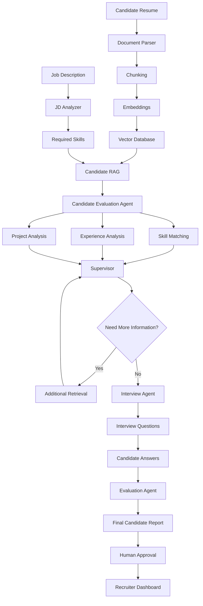

### Features

* Resume upload
* PDF parsing
* Multimodal document processing
* Job description analysis
* Skill extraction
* Semantic candidate matching
* RAG over candidate documents
* Candidate ranking based on explicit criteria
* Interview generation
* Interview evaluation
* Agentic retrieval
* Reflection
* Human approval
* Persistent workflow state
* Recruiter dashboard
* API
* Authentication
* Observability

---

# Suggested Project Progression

Don't jump directly into the capstone.

Build these progressively:

### Project 1 — LLM Assistant

```text
Prompt → LLM → Answer
```

### Project 2 — AI Document Processor

```text
Document → Multiple LLM Tasks → Report
```

### Project 3 — Multi-Purpose Assistant

```text
User → Router → Specialized Workflow
```

### Project 4 — Production RAG

```text
Documents → Vector DB → Retriever → Reranker → LLM
```

### Project 5 — Tool-Using Agent

```text
LLM → Tools → Observations → LLM
```

### Project 6 — Agentic RAG

```text
Agent → Vector DB / SQL / Web → Evidence → Answer
```

### Project 7 — Self-Correcting RAG

```text
Retrieve → Grade → Search Again if Needed → Answer
```

### Project 8 — Multi-Agent Researcher

```text
Supervisor
├── Research
├── Data
├── Fact Check
└── Writer
```

### Project 9 — Human-in-the-Loop Agent

```text
Agent → Approval → Tool → Verification
```

### Project 10 — Final Capstone

```text
Automated Hiring Intelligence Platform
```

---

# Learning Rule

For every workflow, follow this cycle:

```text
Understand
    ↓
Draw the Architecture
    ↓
Implement From Scratch
    ↓
Implement Using LangChain
    ↓
Implement Using LangGraph
    ↓
Add Tools
    ↓
Add Evaluation
    ↓
Add Persistence
    ↓
Deploy
```

Don't just copy a tutorial.

After watching a workflow, close the video and try to draw it yourself.

If you can explain:

> **What is the state?
> What are the nodes?
> What causes the transition?
> Where can it fail?
> Where does the LLM make a decision?
> Where is information retrieved?
> Where can a human intervene?**

then you actually understand the workflow.

---

# Final Mental Model

The evolution of an LLM application looks like:

```text
LLM
 ↓
Chain
 ↓
Workflow
 ↓
RAG
 ↓
Tools
 ↓
Agent
 ↓
Agentic RAG
 ↓
Reflection
 ↓
Human-in-the-Loop
 ↓
Multi-Agent
 ↓
Persistent Agent
 ↓
Production AI System
```

The ultimate goal isn't:

**"I know LangChain."**

It's:

**"I can look at a real-world problem and design the right LLM workflow for it."**
