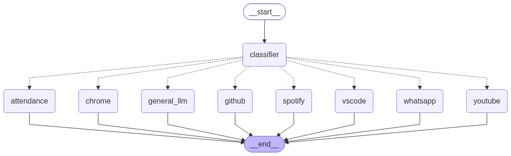
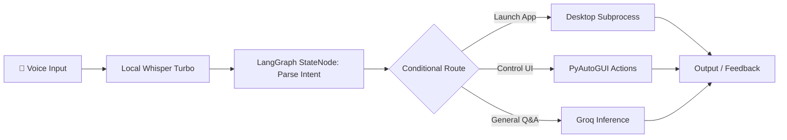

# 🕸️ LangGraph Master Repository

> A comprehensive, hands-on repository covering stateful workflows, graph orchestration, tool-calling agents, memory management, and production-grade Agentic AI built with **LangGraph**, **LangChain**, and **Groq**.



---

## 📖 Overview

This repository documents the progressive journey of building complex, resilient, and multi-step AI systems using **LangGraph**. Unlike traditional linear chains, LangGraph models agentic interactions as directed graphs with cycles, state persistence, conditional branching, and human-in-the-loop controls.

### Highlights
- 🧩 **Stateful Graphs**: Custom schemas with `Pydantic` and `TypedDict` managing conversation state.
- 🔀 **Conditional Routing**: Dynamic decision-making nodes determining subsequent workflow execution.
- 🛠️ **Tool-Calling Agents**: Binding tools and APIs directly to LLMs for automated task execution.
- 🎙️ **Voice-Activated Desktop Assistant**: Multi-modal local desktop control powered by Hugging Face Whisper and LangGraph (`smart.py`).
- 📈 **Progressive Curriculum**: From introductory graph concepts to production-grade agent patterns.

---

## 🗂️ Repository Structure

```text
LANNGRAPH/
├── BASIC/                  # Foundational state graphs and simple nodes
├── LEVEL-2/                # State management and edge routing
├── LEVEL-3/                # Tool integration and function calling
├── LEVEL-4/                # Memory, checkpoints, and conversational persistence
├── LEVEL-5/                # Multi-agent collaboration and hierarchical supervision
├── LEVEL-6/                # Advanced conditional flows and human-in-the-loop
├── PRODUCTION-PRACTICE/    # Real-world agent architectures and error handling
├── PROTOTYPE/              # Rapid experimental workflows
├── smart.py                # Voice-enabled desktop assistant (Whisper + Groq + LangGraph)
├── chatpromt.py            # Prompt engineering and chat model utilities
├── roadmap.md              # Detailed LLM & GenAI engineering roadmap
├── practice.md             # Key interview practice questions & architectural notes
└── IMPORTANT.md            # Crucial reference concepts and best practices
```

---

## 🎙️ Featured Project: Voice-Enabled Desktop Agent (`smart.py`)

`smart.py` is an autonomous desktop assistant combining:
1. **Local Speech Recognition**: OpenAI's `whisper-large-v3-turbo` running locally via Hugging Face Transformers.
2. **Fast Inference**: ChatGroq powering reasoning with sub-second latency.
3. **Graph Execution**: LangGraph `StateGraph` routing user intents to OS automation actions (via `pyautogui`, `pygetwindow`, and `subprocess`).



---

## 🚀 Getting Started

### 1. Prerequisites
- Python 3.10+
- Virtual environment (`venv` or `conda`)
- Groq API Key (for LLM inference)
- Microphone & audio drivers (for `smart.py` voice input)

### 2. Installation

Clone the repository and install required packages:

```bash
git clone https://github.com/Vedant021004/LANNGRAPH.git
cd LANNGRAPH
python -m venv venv
source venv/bin/activate  # On Windows: .\venv\Scripts\activate
pip install langchain langgraph langchain-groq pydantic transformers torch sounddevice scipy pyautogui pygetwindow python-dotenv
```

### 3. Environment Configuration

Create a `.env` file in the root directory:

```env
GROQ_API_KEY=your_groq_api_key_here
```

### 4. Running the Examples

- **Basic Graphs**:
  ```bash
  python BASIC/main.py
  ```
- **Voice Desktop Assistant**:
  ```bash
  python smart.py
  ```

---

## 📚 Learning Curriculum

Refer to [`roadmap.md`](roadmap.md) for the end-to-end curriculum from Python & linear algebra to Transformers, RAG, and LangGraph multi-agent orchestration.

---

## 👥 Contributors & Collaboration

Developed and maintained by:
- **Vedant Kapil** ([@Vedant021004](https://github.com/Vedant021004))
- **VR** ([@riri2006](https://github.com/riri2006))
