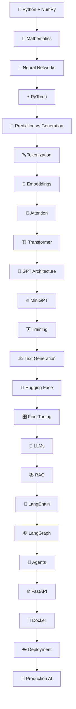
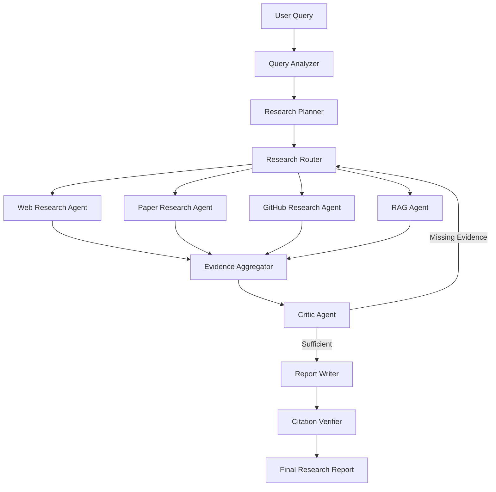

# 🧠 Generative AI & LLM Engineering Roadmap

> A practical, implementation-first roadmap to understand **Generative AI and Large Language Models from the mathematical foundations to production-grade Agentic AI systems.**

The goal is not just to *use* LLMs through APIs.

The goal is to understand:

**How does a model actually generate an answer?**

---

## 🚀 Learning Workflow



---

# 📍 LEVEL 0 — Python & NumPy

### Learn

* Python fundamentals
* Functions
* Classes
* NumPy
* Arrays
* Vectors
* Matrices
* Matrix multiplication
* Tensors

### Build

**Linear Regression from Scratch**

```text
Input
  ↓
Weights
  ↓
Prediction
  ↓
Loss
  ↓
Gradient
  ↓
Update Weights
```

---

# 📍 LEVEL 1 — Mathematics

Learn only the mathematics required to understand machine learning.

### Linear Algebra

* Vectors
* Matrices
* Dot product
* Matrix multiplication
* Transpose
* Dimensions

### Calculus

* Derivatives
* Partial derivatives
* Gradients
* Chain rule

### Probability

* Probability distributions
* Conditional probability
* Softmax
* Cross entropy
* Mean
* Variance

### Build

**Neural Network Mathematics from Scratch**

---

# 📍 LEVEL 2 — Neural Networks

Understand what actually happens inside a neural network.

```text
Input
  ↓
Weights
  ↓
Bias
  ↓
Activation
  ↓
Output
  ↓
Loss
  ↓
Backpropagation
  ↓
Weight Update
```

### Learn

* Forward propagation
* Loss functions
* Gradient descent
* Backpropagation
* Activation functions
* Learning rate
* Epoch
* Batch

### Build

**Neural Network from Scratch using NumPy**

---

# 📍 LEVEL 3 — PyTorch

Move from manual implementation to a deep-learning framework.

### Learn

* Tensor
* `nn.Module`
* `Dataset`
* `DataLoader`
* Optimizers
* Loss functions
* Autograd
* Training loops
* GPU training

### Build

**MNIST Digit Classifier**

Then:

**CIFAR-10 Image Classifier**

---

# 📍 LEVEL 4 — Prediction → Generation

Understand the fundamental difference between traditional ML and generative models.

### Prediction

```text
Input
  ↓
Model
  ↓
Class
```

Example:

```text
Email → Spam
```

### Generation

```text
Input
  ↓
Predict next token
  ↓
Add token
  ↓
Predict next token
  ↓
Add token
  ↓
...
  ↓
Generated Text
```

The key idea:

> **Generative language models generate by repeatedly predicting the next token.**

### Learn

```text
P(next token | previous tokens)
```

### Build

# ✍️ Character-Level Language Model

Example:

```text
Input:

"hello worl"

Prediction:

"d"
```

Then repeatedly generate new characters.

---

# 📍 LEVEL 5 — Tokenization

Move from characters to tokens.

### Learn

* Character tokenization
* Word tokenization
* Subword tokenization
* BPE
* Vocabulary
* Token IDs
* Special tokens

Workflow:

```text
Text
 ↓
Tokenizer
 ↓
Tokens
 ↓
Token IDs
```

Example:

```text
"Transformers are amazing"

        ↓

Tokens

        ↓

Token IDs
```

### Build

# 🔤 BPE Tokenizer from Scratch

---

# 📍 LEVEL 6 — Embeddings

Convert tokens into numerical representations.

```text
Token
  ↓
Embedding Table
  ↓
Vector
```

Example:

```text
"cat"
 ↓
[0.21, 0.73, -0.12, ...]
```

### Learn

* Embedding tables
* Token embeddings
* Semantic similarity
* Positional embeddings

### Build

# 🔢 Mini Embedding System

---

# 📍 LEVEL 7 — Attention

🔥 **One of the most important stages.**

Understand the problem:

```text
The animal didn't cross the road
because it was tired.
```

What does **"it"** refer to?

Attention allows the model to determine which previous tokens are important.

### Learn

* Query
* Key
* Value
* Attention scores
* Scaled dot-product attention
* Self-attention
* Causal masking
* Multi-head attention

Core equation:

```text
Attention(Q,K,V)
```

### Build

# 👀 Self-Attention from Scratch

Using PyTorch without Hugging Face.

---

# 📍 LEVEL 8 — Transformer

Now assemble the components.

```text
Tokens
  ↓
Token Embeddings
  ↓
Positional Information
  ↓
Self-Attention
  ↓
Feed Forward Network
  ↓
Layer Normalization
  ↓
Residual Connection
  ↓
Transformer Block
  ↓
Repeat
  ↓
Output
```

### Learn

* Transformer architecture
* Transformer blocks
* Residual connections
* Layer normalization
* Feed-forward networks
* Causal attention
* Multi-head attention

---

# 📍 LEVEL 9 — GPT Architecture

Understand decoder-only Transformers.

```text
Prompt
  ↓
Tokenizer
  ↓
Token IDs
  ↓
Embeddings
  ↓
Transformer Blocks
  ↓
Logits
  ↓
Softmax
  ↓
Token Probability
```

Then:

```text
Next Token
  ↓
Append to Context
  ↓
Run Model Again
  ↓
Next Token
  ↓
...
```

---

# 📍 LEVEL 10 — Build MiniGPT

🔥 The flagship model-building project.

Build a small GPT-style language model from scratch.

### Components

```text
mini-gpt/
│
├── tokenizer.py
├── dataset.py
├── embeddings.py
├── attention.py
├── transformer.py
├── model.py
├── train.py
├── generate.py
│
├── experiments/
│
├── README.md
└── requirements.txt
```

### Workflow

```text
Dataset
   ↓
Tokenizer
   ↓
Token IDs
   ↓
Training Batches
   ↓
Transformer
   ↓
Logits
   ↓
Cross Entropy
   ↓
Backpropagation
   ↓
Weight Update
   ↓
Repeat
```

---

# 📍 LEVEL 11 — Training & Generation

Understand how an LLM learns.

```text
Text
 ↓
Tokenizer
 ↓
Input Tokens
 ↓
Model
 ↓
Predicted Probabilities
 ↓
Compare with Target
 ↓
Loss
 ↓
Backpropagation
 ↓
Update Weights
```

### Learn

* Training loop
* Cross entropy
* Batch size
* Learning rate
* Epochs
* Validation loss
* Overfitting
* Checkpoints

### Generation

Learn:

* Greedy decoding
* Temperature
* Top-K
* Top-P
* Sampling
* EOS token
* Context window

### Build

# 🤖 MiniGPT Text Generator

---

# 📍 LEVEL 12 — Hugging Face

Now use existing Transformer implementations.

### Learn

* Transformers
* Tokenizers
* Datasets
* Model Hub
* Pretrained models
* Pipelines

Explore:

```text
BERT
GPT-2
DistilBERT
Llama-family models
```

The goal is to understand what the framework is abstracting away.

---

# 📍 LEVEL 13 — Fine-Tuning

Understand:

```text
Pretraining
     ↓
Fine-tuning
     ↓
Instruction tuning
```

Then learn:

```text
Full Fine-Tuning
       ↓
PEFT
       ↓
LoRA
       ↓
QLoRA
```

### Build

# 🎯 BERT Intent Classifier

Then:

# ✍️ Fine-Tuned Small Language Model

---

# 📍 LEVEL 14 — Modern LLM Architecture

Study modern LLM concepts.

### Architecture

* Decoder-only Transformers
* Encoder-only Transformers
* Encoder-decoder
* Causal language modeling
* Masked language modeling

### Modern techniques

* RoPE
* KV Cache
* GQA
* MQA
* Quantization
* Context windows

### Alignment

* Instruction tuning
* RLHF
* DPO

---

# 📍 LEVEL 15 — RAG

Now solve the knowledge problem.

### Problem

The model cannot reliably know every private or newly created piece of information.

### Solution

```text
Documents
    ↓
Chunking
    ↓
Embeddings
    ↓
Vector Database
    ↓
Retriever
    ↓
Relevant Context
    ↓
LLM
    ↓
Answer
```

### Learn

* Document loaders
* Chunking
* Embeddings
* Vector databases
* Similarity search
* Hybrid search
* Reranking
* Retrieval evaluation

### Build

# 📚 Production RAG System

---

# 📍 LEVEL 16 — LangChain

Now learn the application framework.

### Learn

```text
Models
Prompts
Messages
Structured Output
Tools
Retrievers
Document Loaders
Chains
```

Mental model:

```text
LLM
 +
Tools
 +
Data
 +
Prompts
 +
Retrieval
```

---

# 📍 LEVEL 17 — LangGraph

Now build stateful agent workflows.

### Learn

```text
State
 ↓
Nodes
 ↓
Edges
 ↓
Conditional Edges
 ↓
Routers
 ↓
ToolNode
 ↓
Loops
 ↓
Reducers
 ↓
Subgraphs
 ↓
Persistence
 ↓
Human-in-the-loop
 ↓
Streaming
```

### Core mental model

```text
State
  ↓
Node
  ↓
Decision
  ↓
Next Node
  ↓
State Update
  ↓
...
```

---

# 📍 LEVEL 18 — Agentic AI

Build a real multi-agent system.

# 🤖 Deep Research Agent



### Features

* Dynamic planning
* Tool calling
* Parallel research
* State management
* Conditional routing
* Self-correction
* Citation verification
* Persistent sessions
* Human approval

---

# 📍 LEVEL 19 — Production AI

Turn the project into a deployable system.

```text
Frontend
   ↓
Next.js
   ↓
FastAPI
   ↓
LangGraph
   ↓
LLM
   ↓
Tools / RAG
   ↓
PostgreSQL / Supabase
```

### Infrastructure

```text
Docker
 ↓
CI/CD
 ↓
Cloud
```

### Learn

* REST APIs
* Authentication
* Async execution
* Streaming
* Caching
* Rate limiting
* Logging
* Error handling
* Evaluation
* Observability
* Cost optimization

---

# 🏆 Project Roadmap

| #  | Project                        | Main Concept     |
| -- | ------------------------------ | ---------------- |
| 01 | Linear Regression from Scratch | Mathematics      |
| 02 | Neural Network from Scratch    | Backpropagation  |
| 03 | MNIST Classifier               | PyTorch          |
| 04 | Character Language Model       | Generation       |
| 05 | BPE Tokenizer                  | Tokenization     |
| 06 | Embedding System               | Representations  |
| 07 | Self-Attention                 | Attention        |
| 08 | Transformer from Scratch       | Transformer      |
| 09 | **MiniGPT**                    | Generative LLM   |
| 10 | BERT Intent Classifier         | Fine-tuning      |
| 11 | Production RAG                 | Retrieval        |
| 12 | LangChain Application          | LLM Applications |
| 13 | **Deep Research Agent**        | LangGraph        |
| 14 | **Production Agentic AI**      | Deployment       |

---

# 🧠 The Final Mental Model

After completing this roadmap, you should be able to understand the entire stack:

```text
                    USER
                     │
                     ▼
                APPLICATION
                     │
                     ▼
                  AGENT
                     │
                     ▼
                LANGGRAPH
                     │
                     ▼
                LANGCHAIN
                     │
              ┌──────┴──────┐
              ▼             ▼
             RAG          TOOLS
              │             │
              └──────┬──────┘
                     ▼
                    LLM
                     │
                     ▼
               TRANSFORMER
                     │
          ┌──────────┴──────────┐
          ▼                     ▼
      ATTENTION             EMBEDDINGS
          │                     │
          └──────────┬──────────┘
                     ▼
                 TOKENS
                     │
                     ▼
              NEURAL NETWORK
                     │
                     ▼
               MATHEMATICS
```

---

# 🎯 Final Goal

Don't stop at:

> **"I know how to call an LLM."**

Reach:

> **"I understand how an LLM generates tokens, how Transformers process context, how models are trained and fine-tuned, how RAG supplies external knowledge, and how LangChain/LangGraph turn those models into production-grade AI agents."**

```text
Understand the math
        ↓
Build neural networks
        ↓
Build a language model
        ↓
Build a Transformer
        ↓
Build MiniGPT
        ↓
Fine-tune models
        ↓
Build RAG
        ↓
Build LangChain applications
        ↓
Build LangGraph agents
        ↓
Deploy production AI
        ↓
🚀 AI / LLM Engineer
```
